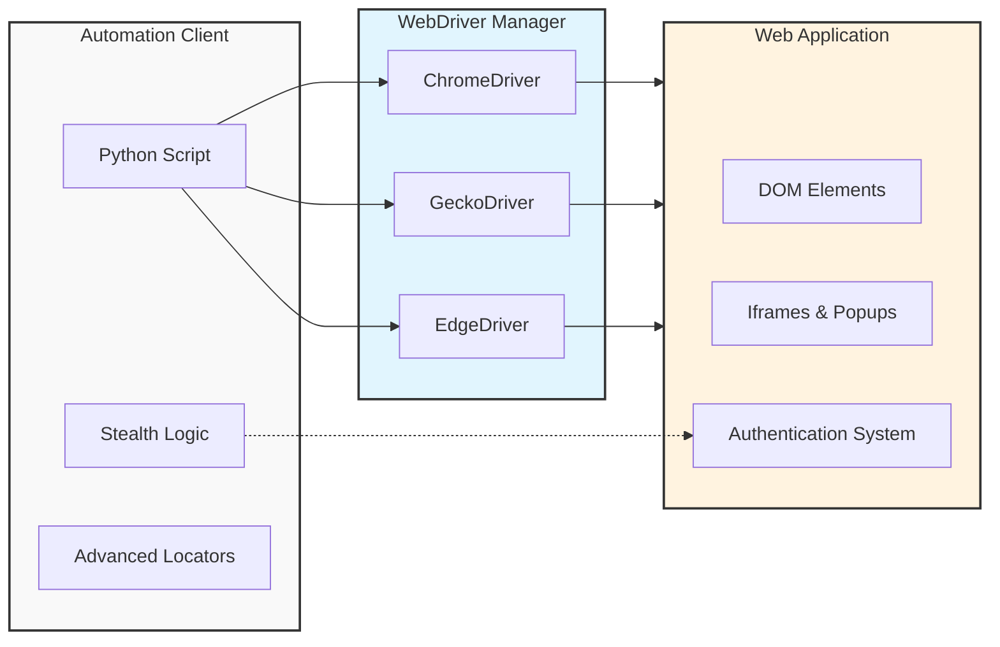

# Alnafi Selenium Automation Framework: Advanced Web Testing & Botting

**Author:** Saleem Ali
**Domain:** QA Automation, Web Scraping, & Bot Development
**Tech Stack:** Python 3.x, Selenium WebDriver, BeautifulSoup4, ActionChains

---

## ==>> Project Overview

This repository houses a comprehensive **Web Automation Framework** designed to simulate human behavior and interact with complex web elements. Unlike standard automation scripts that simply "click and type," this project implements advanced algorithms to bypass bot detection mechanisms using randomized delays and human-like mouse movements.

The framework covers the entire spectrum of UI Automation, from handling dynamic DOM elements and iFrames to managing cross-browser compatibility layers for Chrome, Firefox, and Edge.

---

## ==>> System Architecture

The following diagram illustrates the interaction flow between the Python automation scripts, the WebDriver manager, and the target web applications.



---

## ==>> Key Technical Features

### => 1. Stealth & Human Emulation

To interact with high-security platforms (such as Gmail), this framework implements a **"Human Typing"** algorithm.

* **Randomized Delays:** Keystrokes are sent with random time intervals (e.g., 0.05s to 0.2s) to mimic natural typing rhythm.
* **Mouse Movement:** Mouse cursor paths are randomized using `ActionChains` to avoid straight-line robotic detection.
* **Flag Removal:** Disables the `AutomationControlled` flag in the browser to prevent detection by anti-bot systems.

### => 2. Advanced Mouse & Keyboard Actions

The project utilizes the `ActionChains` class to handle complex UI interactions that standard clicks cannot perform:

* **Drag & Drop:** Automating slider controls and element reordering.
* **Context Actions:** Handling Right-Click (Context Menu) and Double-Click events.
* **Hover Effects:** Interacting with dynamic navigation menus that only appear on mouse hover.

### => 3. Dynamic Element Handling

Robust strategies for locating and interacting with elements:

* **Synchronization:** Replaced static `time.sleep` with dynamic `WebDriverWait` and `ExpectedConditions` to handle AJAX loading.
* **Complex Locators:** Usage of advanced CSS Selectors and XPath axes (parent, child, sibling) to find elements without stable IDs.
* **Frame Management:** Logic to seamlessly switch context between multiple Browser Tabs, Windows, and iFrames.

### => 4. Cross-Browser Infrastructure

The framework is browser-agnostic. It utilizes `webdriver_manager` to automatically detect the installed browser version and download the matching binary (ChromeDriver, GeckoDriver, EdgeDriver) at runtime, eliminating manual path configuration.

---

## ==>> Installation & Setup

### => Prerequisites

* Python 3.8 or higher
* Google Chrome, Firefox, or Microsoft Edge browser

### => Step 1: Clone Repository

```bash
git clone [https://github.com/YourUsername/alnafi-selenium-automation.git](https://github.com/YourUsername/alnafi-selenium-automation.git)
cd alnafi-selenium-automation

```

### => Step 2: Install Dependencies

```bash
pip install selenium webdriver-manager beautifulsoup4

```

### => Step 3: Run Automation Scripts

**Example 1: Run a Stealth Login**

```bash
python gmail_login-1.py

```

**Example 2: Run Advanced Mouse Actions**

```bash
python drag_slider_range.py

```

---

## ==>> Project Structure

```text
├── Drivers/                   # Local driver binaries (optional fallback)
├── screenshot/                # Directory for automated evidence capture
├── Alert_handeling.py         # JavaScript Alert management
├── drag_slider_range.py       # ActionChains drag-and-drop logic
├── gmail_login-1.py           # Stealth login implementation
├── scraping.py                # BeautifulSoup data extraction integration
├── screenshot_full_page.py    # JavaScript-based full page capture
├── tab_handling.py            # Multi-window switching logic
├── web_driver_auto_update.py  # Driver manager configuration
└── README.md                  # Project documentation

```

---

## ==>> Disclaimer

This project is for **educational and testing purposes only**. The stealth techniques demonstrated here are intended to help QA engineers understand how to test robust applications and should not be used for unauthorized scraping or botting activities.

---

## ==>> Contact

**Saleem Ali**

* **Role:** QA Automation Engineer & SDET
* **Focus:** Building reliable, scalable, and human-like automation frameworks.

```

```